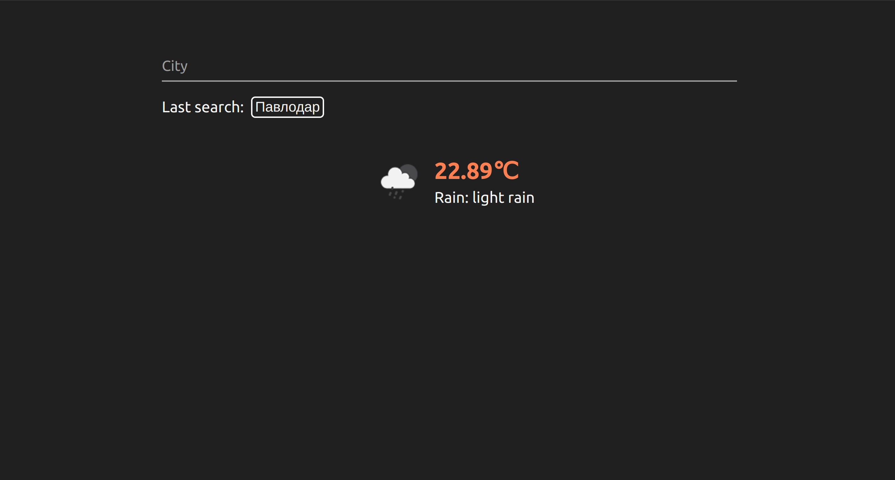
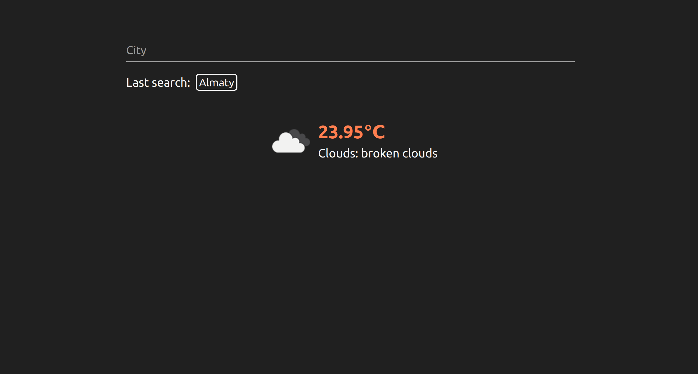
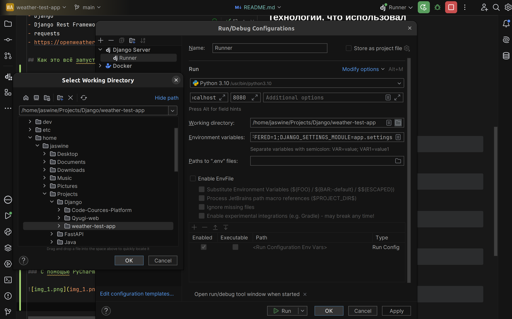
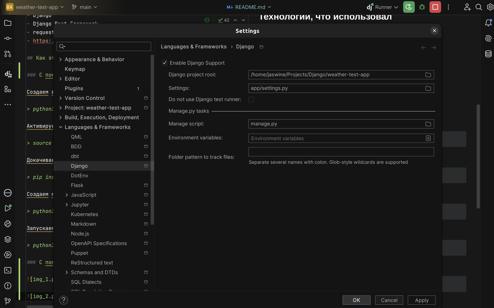

# Weather App

## Что было сделано

- Вывел прогноз погоды
- Написал тесты для сервисов и сериалайзеров
- Написал Docker и docker-compose файлы
- Добавил сохранение последнего отправленного города в куки
- Добавил сохранение истории поиска и написал апи, показывающее сколько раз вводили какой город

## Технологии, что использовал

- Python 
- Django 
- Django Rest Framework
- requests
- https://openweathermap.org/current (api)

## Как это всё запустит

### С помощью терминала:

Создаем виртуальное окружение 

> python3 -m venv .venv

Активируем его

> source venv/bin/activate

Докачиваем всякое

> pip install -r requirements.txt

Создаем миграции в бд

> python3 manage.py migrate

Запускаем

> python3 manage.py runserver 8080

### С помощью PyCharm

